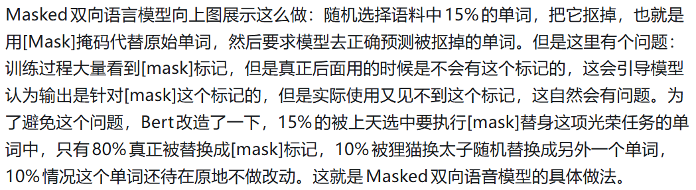

# Q1：双向语言模型的意义？（已解决）
现在的大语言模型 不都是问答任务，即根据上文预测下问吗？那为啥bert预训练用双向语言模型的效果会比GPT的单向语言模型好得多？反正最后应用的时候也不会有后文的信息，为啥预训练要用到后文信息？

## 结合ChatGPT的回答，我的理解：
本质是任务类型不同，Bert当初设计是为了语言理解，而不是文本生成。Bert的设计模式导致了他非常擅长语言理解，而不擅长文本生成。但是随着现在大语言模型的发展，GPT又重新成为主流。

## Reflection：
GPT 后来重新成为主流，并不代表 BERT 的思路错了，而是大模型时代大家更想解决“统一任务”的问题。因为生成模型其实也能做理解任务，但反过来理解模型很难做生成。只要统一成“预测下一个 token”这一种任务，就能不断往上堆更多无监督数据，而互联网文本天然就适合这种训练方式。说到底还是要看训练的数据量。

# Q2: 为什么Encoder编码器更擅长理解，Decoder解码器更擅长预测输出？（已解决）
根据Transformer的结构，以及GPT-style LLM的Transformer Decoder-only架构联想到这个问题。

## 我的理解：
在 Transformer 里，Encoder 使用的是 Full Self-Attention，每个 token 都能同时看到整个句子的所有内容，因此更适合理解完整语义和上下文关系；而 Decoder 使用的是 Masked Self-Attention，只能看到前面的 token，不能偷看未来，所以天然适合根据前文一步一步预测下一个 token，也就是文本生成。

## Reflection：
并不绝对。

# Q3：不太懂图中狸猫换太子的意义，难道模型会这么通人性，还会偷懒吗？预训练的意义不就是挖去一些参数，然后让他自己训练，不断优化参数，只要最后性能变好了，让他自己学习不就行了？（已解决）

## 理解有问题！
这其实是很简单的问题，就像图像分类问题中识别图片里有没有奶牛，虽然最后准确率很高，但是模型根本没学会————因为他的判断标准是图片中有没有草地。
这里的Mask问题也类似，模型在降低loss的过程中，会发现作弊的方法才是最快的方法：遇到[mask]标记才会预测输出。所以我们必须加入随机替换，防止模型作弊。

## Reflection：
预训练数据和真实数据（或者说你的目标任务）的差异不能太大。
训练时谨防模型偷懒。