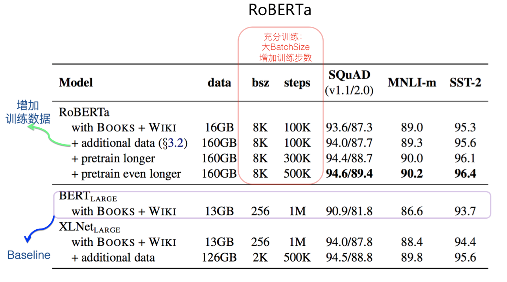
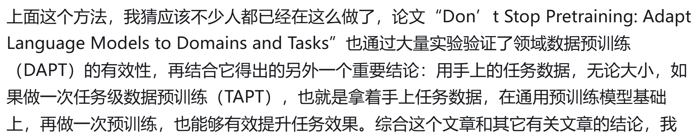
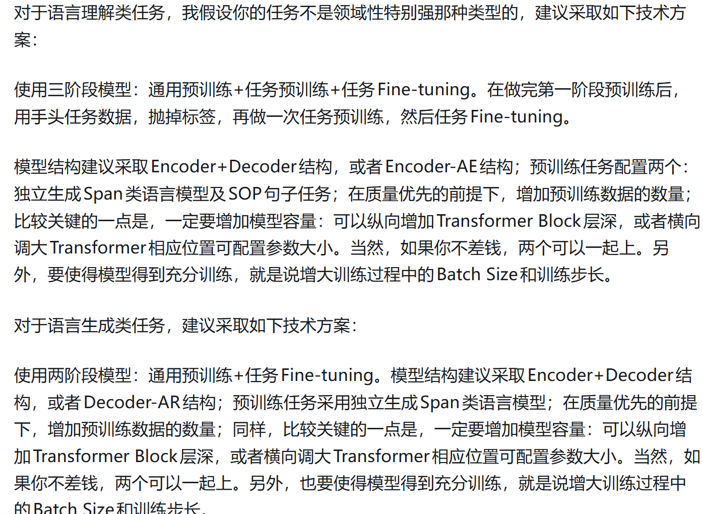

# Q1：为什么RoBEARTa增大BatchSize和训练步数就能让训练效果提升这么明显，而我平常跑实验这么做还掉点？

## 我的理解：
oBERTa 增大 Batch Size 和训练步数之所以效果提升明显，本质原因是原始 BERT 当时其实没有被“充分训练”。RoBERTa 使用了更大的数据规模、更长的训练时间和更大的 Batch，使模型能继续从海量文本中学习语言规律。而我们平时做的很多实验通常是小数据集上的 fine-tuning，模型很容易过拟合，继续增大 Batch 或训练更久，往往只会让模型更快“记住数据”，不一定能提升泛化能力。所以预训练阶段和普通小任务训练，本质上是两种不同场景。

# Q2：用任务数据做预训练，这不算数据泄露吗？

## 结合博客后文，我的理解：
其本质是：用手头数据，抛掉数据标签，再做一次预训练，无论手上任务数据有多少。
TAPT（任务级预训练）通常不算数据泄露，因为它不会使用任务标签，而只是利用手头任务的数据文本继续做无监督预训练，例如 MLM 或 Span Mask。模型学习的是该任务领域中的语言风格、术语和数据分布，而不是正确答案。

# Q3：为什么作者推荐语言理解任务通常采用三阶段训练，而语言生成任务更多采用两阶段训练？

## 我的理解：
语言理解任务更依赖模型对具体任务数据分布和领域表达的适应能力，因此通常会增加 TAPT（任务预训练）阶段，让模型先熟悉任务文本，再进行 Fine-tuning，所以更适合三阶段训练；而语言生成任务更依赖大模型在通用预训练中学到的整体语言生成能力，通用预训练往往已经足够强，因此通常直接 Fine-tuning 即可，两阶段训练就能取得较好效果。
