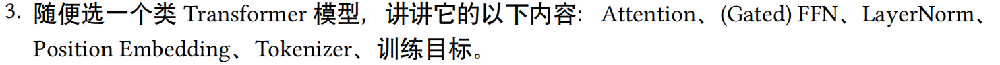
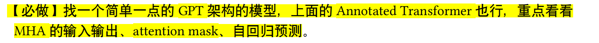

# Task 3 · Annotated Transformer 流程拆解

## 参考代码：the_annotated_transformer.py

## 参考资料：https://nlp.seas.harvard.edu/annotated-transformer/

## 任务：




## 1. 输入是怎么变成模型能吃的张量的


这份代码没有专门写一个很复杂的 `Tokenizer` 类，而是把输入处理拆成了几步：先用 `spacy` 把句子分成 token，再用 `vocab` 把 token 转成数字 id，最后用 `collate_batch` 把一批句子补齐长度，拼成 batch 张量。


## 2. Embedding 和位置编码

`Embeddings` 做的事情其实很简单，就是把 token id 查表变成向量，代码里还会额外乘一个 `sqrt(d_model)` 来让数值尺度更稳定。

- 注：为什么要乘 `sqrt(d_model)` ？主要是因为 embedding 初始数值通常比较小，而后面还要和位置编码直接相加，所以这里相当于先把 embedding “放大一点”，避免它在数值上被位置编码压过去。这样 embedding 和 position encoding 的量级会更接近，训练也会更稳定。

然后是 sin/cos 位置编码，代码里会提前把整张位置编码表算好，`forward` 时直接和 embedding 相加，再做一次 dropout。

```1488:1547:references/annotated-transformer-master/annotated-transformer-master/the_annotated_transformer.py
def collate_batch(
    batch,
    src_pipeline,
    tgt_pipeline,
    src_vocab,
    tgt_vocab,
    device,
    max_padding=128,
    pad_id=2,
):
    bs_id = torch.tensor([0], device=device)  # <s> token id
    eos_id = torch.tensor([1], device=device)  # </s> token id
    src_list, tgt_list = [], []
    for (_src, _tgt) in batch:
        processed_src = torch.cat(
            [
                bs_id,
                torch.tensor(
                    src_vocab(src_pipeline(_src)),
                    dtype=torch.int64,
                    device=device,
                ),
                eos_id,
            ],
            0,
        )
        processed_tgt = torch.cat(
            [
                bs_id,
                torch.tensor(
                    tgt_vocab(tgt_pipeline(_tgt)),
                    dtype=torch.int64,
                    device=device,
                ),
                eos_id,
            ],
            0,
        )
        src_list.append(
            # warning - overwrites values for negative values of padding - len
            pad(
                processed_src,
                (
                    0,
                    max_padding - len(processed_src),
                ),
                value=pad_id,
            )
        )
        tgt_list.append(
            pad(
                processed_tgt,
                (0, max_padding - len(processed_tgt)),
                value=pad_id,
            )
        )

    src = torch.stack(src_list)
    tgt = torch.stack(tgt_list)
    return (src, tgt)
```


## 3. Attention 和 Multi-Head Attention

### Scaled Dot-Product Attention

核心公式就是：

1. 计算 `QK^T`；
2. 除以 `sqrt(d_k)`；
3. 如有 mask，把不能看的位置填成很小的值；
4. 做 softmax；
5. 再和 `V` 相乘得到输出。

### Multi-Head Attention

`MultiHeadedAttention` 的流程是：

- 用 3 个线性层分别投影 `Q`、`K`、`V`；
- 把 `d_model` 切成 `h` 个 head，每个 head 的维度是 `d_k = d_model / h`；
- 每个 head 单独做 attention；
- 拼回去后再过最后一个线性层。


在编码器和解码器里，Q/K/V 的来源不同：

- encoder self-attention：`Q = K = V = x`
- decoder self-attention：`Q = K = V = x`，但会加 **tgt mask**
- decoder cross-attention：`Q` 来自 decoder，`K/V` 来自 encoder memory

Scaled dot-product 与 mask、dropout 的落点在一处函数里：

```519:528:references/annotated-transformer-master/annotated-transformer-master/the_annotated_transformer.py
def attention(query, key, value, mask=None, dropout=None):
    "Compute 'Scaled Dot Product Attention'"
    d_k = query.size(-1)
    scores = torch.matmul(query, key.transpose(-2, -1)) / math.sqrt(d_k)
    if mask is not None:
        scores = scores.masked_fill(mask == 0, -1e9)
    p_attn = scores.softmax(dim=-1)
    if dropout is not None:
        p_attn = dropout(p_attn)
    return torch.matmul(p_attn, value), p_attn
```

多头则是三个线性投影、`view` 成 `(batch, h, seq, d_k)`，共享上面的 `attention`，最后再线性压回 `d_model`：

```601:628:references/annotated-transformer-master/annotated-transformer-master/the_annotated_transformer.py
    def forward(self, query, key, value, mask=None):
        "Implements Figure 2"
        if mask is not None:
            mask = mask.unsqueeze(1)
        nbatches = query.size(0)
        query, key, value = [
            lin(x).view(nbatches, -1, self.h, self.d_k).transpose(1, 2)
            for lin, x in zip(self.linears, (query, key, value))
        ]
        x, self.attn = attention(
            query, key, value, mask=mask, dropout=self.dropout
        )
        x = (
            x.transpose(1, 2)
            .contiguous()
            .view(nbatches, -1, self.h * self.d_k)
        )
        return self.linears[-1](x)
```

Encoder / Decoder 里 Q、K、V 怎么接，可以直接看子层调用（self-attn 用同一 `x`，cross-attn 用 `memory`）：

```377:379:references/annotated-transformer-master/annotated-transformer-master/the_annotated_transformer.py
    def forward(self, x, mask):
        "Follow Figure 1 (left) for connections."
        x = self.sublayer[0](x, lambda x: self.self_attn(x, x, x, mask))
        return self.sublayer[1](x, self.feed_forward)
```

```424:429:references/annotated-transformer-master/annotated-transformer-master/the_annotated_transformer.py
    def forward(self, x, memory, src_mask, tgt_mask):
        "Follow Figure 1 (right) for connections."
        m = memory
        x = self.sublayer[0](x, lambda x: self.self_attn(x, x, x, tgt_mask))
        x = self.sublayer[1](x, lambda x: self.src_attn(x, m, m, src_mask))
        return self.sublayer[2](x, self.feed_forward)
```

---

## 4. Mask 为什么重要

### `subsequent_mask(size)`

这个函数会构造一个“不能看未来”的上三角 mask，保证解码时当前位置只能访问自己之前的 token。

`subsequent_mask` 用上三角得到“只能看过去”；`make_std_mask` 再与 padding mask 按位与。

```441:447:references/annotated-transformer-master/annotated-transformer-master/the_annotated_transformer.py
def subsequent_mask(size):
    "Mask out subsequent positions."
    attn_shape = (1, size, size)
    subsequent_mask = torch.triu(torch.ones(attn_shape), diagonal=1).type(
        torch.uint8
    )
    return subsequent_mask == 0
```

```919:926:references/annotated-transformer-master/annotated-transformer-master/the_annotated_transformer.py
    @staticmethod
    def make_std_mask(tgt, pad):
        "Create a mask to hide padding and future words."
        tgt_mask = (tgt != pad).unsqueeze(-2)
        tgt_mask = tgt_mask & subsequent_mask(tgt.size(-1)).type_as(
            tgt_mask.data
        )
        return tgt_mask
```

---

## 5. FFN：每个位置单独再变换一次

**`PositionwiseFeedForward`** 的结构是：

`d_model -> d_ff -> d_model`

中间用 ReLU 和 dropout。

这里的参数是共享的。

```677:687:references/annotated-transformer-master/annotated-transformer-master/the_annotated_transformer.py
class PositionwiseFeedForward(nn.Module):
    "Implements FFN equation."

    def __init__(self, d_model, d_ff, dropout=0.1):
        super(PositionwiseFeedForward, self).__init__()
        self.w_1 = nn.Linear(d_model, d_ff)
        self.w_2 = nn.Linear(d_ff, d_model)
        self.dropout = nn.Dropout(dropout)

    def forward(self, x):
        return self.w_2(self.dropout(self.w_1(x).relu()))
```

---

## 6. 残差连接和 LayerNorm

采用Pre-Norm结构： 
x → LayerNorm → Attention / FFN → 残差相加

```344:357:references/annotated-transformer-master/annotated-transformer-master/the_annotated_transformer.py
class SublayerConnection(nn.Module):
    """
    A residual connection followed by a layer norm.
    Note for code simplicity the norm is first as opposed to last.
    """

    def __init__(self, size, dropout):
        super(SublayerConnection, self).__init__()
        self.norm = LayerNorm(size)
        self.dropout = nn.Dropout(dropout)

    def forward(self, x, sublayer):
        "Apply residual connection to any sublayer with the same size."
        return x + self.dropout(sublayer(self.norm(x)))
```

---

## 7. 训练目标和自回归生成

### 训练时

`Batch` 会把目标序列切成两部分：

- `tgt`：decoder 的输入，等于右移后的前缀；
- `tgt_y`：真实标签，也就是要预测的下一个 token。

这就是标准的 teacher forcing：输入前一个词，预测下一个词。

`Batch` 里把 `tgt` 切成 `tgt[:, :-1]` 作为 decoder 输入（去掉最后一个词用于预测）、`tgt[:, 1:]` 作为预测目标（去掉第一个词作为答案），并顺带统计非 padding token 数用于 loss 归一：

```910:917:references/annotated-transformer-master/annotated-transformer-master/the_annotated_transformer.py
    def __init__(self, src, tgt=None, pad=2):  # 2 = <blank>
        self.src = src
        self.src_mask = (src != pad).unsqueeze(-2)
        if tgt is not None:
            self.tgt = tgt[:, :-1]
            self.tgt_y = tgt[:, 1:]
            self.tgt_mask = self.make_std_mask(self.tgt, pad)
            self.ntokens = (self.tgt_y != pad).data.sum()
```

### 输出层

**`Generator`** 会把 decoder 输出映射到词表大小，再做 `log_softmax`，用于计算损失。

```256:264:references/annotated-transformer-master/annotated-transformer-master/the_annotated_transformer.py
class Generator(nn.Module):
    "Define standard linear + softmax generation step."

    def __init__(self, d_model, vocab):
        super(Generator, self).__init__()
        self.proj = nn.Linear(d_model, vocab)

    def forward(self, x):
        return log_softmax(self.proj(x), dim=-1)
```

### 推理时

`greedy_decode` 的逻辑是：

1. 先 encode 一次源句子；
2. 从开始符号开始生成；
3. 每次都只把已经生成的前缀喂回 decoder；
4. 取最后一个位置的输出，选概率最大的下一个 token；
5. 把新 token 接到序列后面，循环直到结束。

这就是典型的**自回归生成**：每一步都只依赖已经生成的内容。

与上文文字一一对应：`encode` 一次；循环里用当前前缀且 **每步**传入 `subsequent_mask(ys.size(1))`；只对最后一个位置取 `generator` 输出并 `argmax` 追加 token。

```1313:1326:references/annotated-transformer-master/annotated-transformer-master/the_annotated_transformer.py
def greedy_decode(model, src, src_mask, max_len, start_symbol):
    memory = model.encode(src, src_mask)
    ys = torch.zeros(1, 1).fill_(start_symbol).type_as(src.data)
    for i in range(max_len - 1):
        out = model.decode(
            memory, src_mask, ys, subsequent_mask(ys.size(1)).type_as(src.data)
        )
        prob = model.generator(out[:, -1])
        _, next_word = torch.max(prob, dim=1)
        next_word = next_word.data[0]
        ys = torch.cat(
            [ys, torch.zeros(1, 1).type_as(src.data).fill_(next_word)], dim=1
        )
    return ys
```

