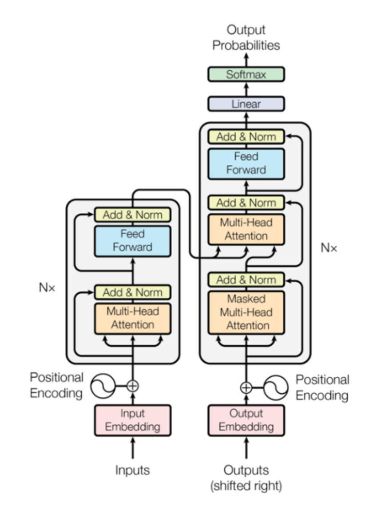
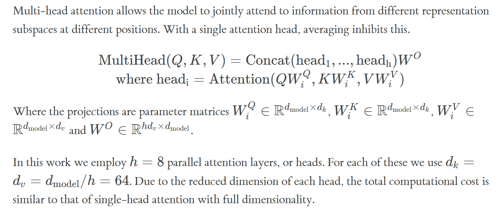
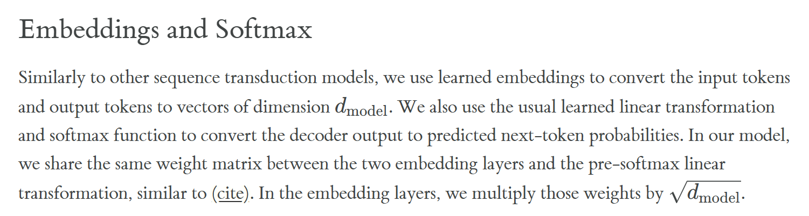
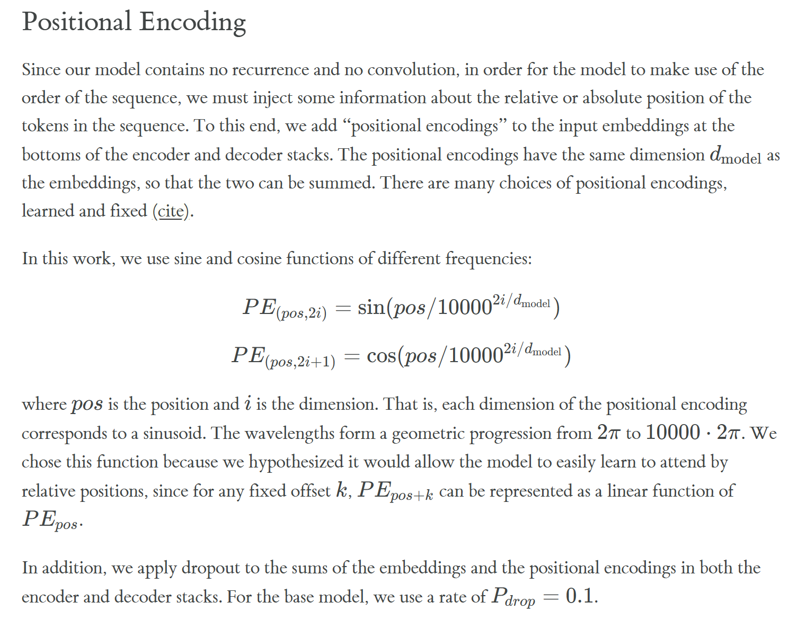

# 1.拆解 Transformer 中的 MHA（Multi-Head Attention）

在整个 Transformer 结构中，MHA 一共出现了三次：

1. Encoder Self-Attention  
Encoder 内部的 token 彼此做 attention，用来理解输入句子内部的关系。这里 Q、K、V 都来自 Encoder 本身，因此叫 Self-Attention。

2. Decoder Masked Self-Attention  
Decoder 生成文本时，也会做 Self-Attention，但为了保证“自回归生成”，当前位置不能提前看到未来 token，因此会加入 Mask，只允许看到当前位置之前的信息。

3. Encoder-Decoder Attention（Cross Attention）  
Decoder 在生成下一个 token 时，还需要去关注 Encoder 编码后的输入信息。这里 Query 来自 Decoder，而 Key 和 Value 来自 Encoder，因此属于 Cross Attention。

# Q1:为什么MHA的计算成本能做到和单头自注意力的相当？

## 之前对MHA的理解有错误！

假设h=8，我之前以为MHA就是复制8个完整的 Attention，所以想当然的以为他的计算量会比单头 Attention 多很多。实际上，Transformer 更巧妙的地方在于：它并不是简单复制，而是把原本的大维度切分成多个小维度。例如原本一个 512 维的 Attention，会被拆成 8 个 64 维的小 Attention 并行计算，因此总维度并没有增加。

## 简单粗略计算一下

n个token 8个头 512维
单头自注意力 n²*512
多头自注意力 8*n²*64
显然是一样的

# Q2：解决完Q1，那么问题又来了，为啥MHA拆分个维度就能比单头自注意力的性能更好？那是不是头越多越好？

## 先回答第一点：为什么？

引入“Disentanglement”（解耦）的思想，尽量让不同类型的信息分开表示，而不是全部混在一起学习。在深度学习里，如果语法、语义、位置、风格等信息都挤在同一个表示空间中，模型会更难学习，因为不同特征之间会互相干扰。于是很多模型都会尝试把不同模式拆开处理，例如 CNN 中不同卷积核学习不同纹理，MoE 中不同专家负责不同任务，而 Transformer 的 Multi-Head Attention 则让不同 head 分别学习不同类型的语言关系，它把原本混在一起的语言关系拆到了不同子空间中，让不同 head 可以专注学习不同模式，从而减少信息干扰。这种“分而治之”的思想，本质上就是一种解耦。

## 再回答第二点： Head 越多越好吗？

Multi-Head Attention 并不是 head 越多越强，因为 head 数量增加后，每个 head 能分到的维度会越来越小。例如总维度固定为 512 时，8 个 head 每个还能有 64 维，但如果增加到 64 个 head，每个 head 就只剩下 8 维，表达能力会明显下降。真正重要的不是“头的数量”，而是不同 head 是否能够学习到不同类型的信息，比如语法关系、语义关系、长距离依赖等。当 head 已经足够覆盖这些关系后，继续增加 head 往往只会带来冗余，而不一定提升模型性能。

事实上，head_dim 比 head_num 更关键。head_dim=64是一个很经典的实验配置，实验证明，64~128维这样的维度比较合适，既能形成“分工”，又不会损失表达能力。

# 2.拆解FFN

# Q3：为什么 FFN 要采用先升维再降维的结构？

先简单概括 FFN 的作用：

1. 通过激活函数引入非线性能力  
2. 对每个 token 进行深度加工  
3. 存储模型知识（参数量大的重要来源）

## 高维空间能够提供更强的特征表达能力
Transformer 中的 FFN 通常采用“升维 → 激活 → 降维”的结构，例如从 512 维先扩展到 2048 维，再压回 512 维。这样做的核心原因，是为了让模型能够在更高维空间中学习更加复杂的特征组合。如果直接在原始维度上做非线性变换，模型的表达能力会受到限制；而升维后，特征会被展开到一个更宽的空间中，不同模式更容易被分离、组合和加工，再通过激活函数（如 ReLU、GELU）引入非线性，最后再压缩回原始维度，方便后续层继续处理。

# 现在的 FFN 一般用什么激活函数？

最早的 Transformer 在 FFN 中使用的是 ReLU 激活函数，其优点是结构简单、计算速度快，但缺点也比较明显，例如负数会被直接截断，表达能力相对有限。后来 BERT、GPT 等模型逐渐开始使用 GELU（Gaussian Error Linear Unit），相比 ReLU，GELU 更平滑，能够保留部分负值信息，因此梯度传播更加稳定，模型表达能力也更强。

而在当前的大模型中，例如 LLaMA、PaLM、Gemini 等，FFN 已经大量采用 SwiGLU 等门控激活结构。相比传统的单分支激活函数，SwiGLU 会引入一种“门控机制”，即一部分分支负责生成特征，另一部分分支负责控制信息通过多少，从而能够更加灵活地调节信息流动。研究发现，这类门控结构通常比 GELU 拥有更好的参数利用率和表达能力，因此已经逐渐成为现代 Transformer 中 FFN 的主流设计。

# 3.Embedding

# Q4： 为啥Embedding 和输出 Linear 共享权重？

Transformer 中的输入 Embedding 本质上是在做“token → 向量”的映射，而 Decoder 最后的输出 Linear 则是在做“向量 → token”的映射，两者实际上属于同一个语义空间中的编码与解码过程。因此 Transformer 会让它们共享同一个权重矩阵（Weight Tying）。这样做不仅能够显著减少模型参数量，还能让模型在“读词”和“预测词”时使用一致的语义表示，从而提升训练稳定性与泛化能力。
  
# 4.Positional Encoding

# Q4：至今不懂位置编码和正余弦函数有何关系？

## GPT告诉我：
为什么偏偏用正余弦函数呢？其实很多人第一次看到那个公式都会觉得特别抽象，但本质原因并没有那么玄学。Transformer 需要一种“连续变化”的位置表示方法，也就是说：不同位置的向量既不能完全一样，又最好能够体现“距离关系”。而正余弦函数天然就非常适合做这种事情，因为它会随着位置不断平滑变化。例如：
sin(1)
sin(2)
sin(3)
...
每个位置的值都不同，而且变化是连续、规律的。更重要的是，论文不是只用一种 sin/cos，而是用了很多不同频率的正余弦。有的变化特别快，用来感知局部位置；有的变化特别慢，用来感知长距离位置。于是不同维度共同组合后，每个位置都会得到一个独特的位置向量。

更巧妙的是，正余弦还有一种天然的“平移关系”。简单理解就是：
pos
和
pos+k
之间的变化是有规律的。

此外，这种连续函数具有很好的泛化能力。由于正余弦的位置表示是通过数学规律直接计算得到的，而不是像“可学习位置编码”那样只记住训练时见过的位置，因此即使在测试时遇到比训练阶段更长的序列，模型依然能够继续计算出新的位置向量。也就是说，正余弦位置编码不是“记忆具体位置”，而是在学习一种连续、可扩展的位置变化规律，因此更容易处理超出训练长度范围的长序列。

 ## 如懂。

# 整理一下Transformer里用到dropout的地方

Dropout 本质上是一种防止过拟合的方法，训练时会随机把一部分神经元输出置零，避免模型过度依赖某些固定特征。
1. embedding 和位置编码相加之后：输入层的信息最容易被模型死记硬背。这里随机丢掉一部分特征，可以避免模型过度依赖某些固定 token 或固定位置。
2. attention 的权重之后：相当于随机“断开”部分 token 之间的注意力关系。
3. FFN 中间：FFN 参数量非常大，最容易过拟合。
4. residual connection：防止模型过度依赖 shortcut，而不真正学习子层里的复杂变换

