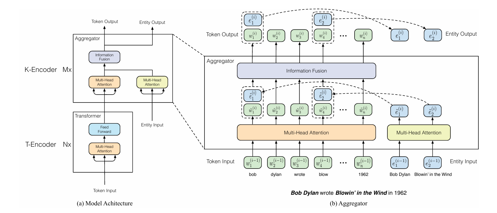

# ERNIE

## 原论文：[ERNIE Paper](../../references/ERNIE.pdf)

### 注：由于时间关系，只粗略看了论文摘要、引言和论文里的图。

# T-Encoder
论文中说，T-Encoder basically follows BERT.

所以图中左下 T-Encoder 就是BERT，负责文本语义建模。

# K-Encoder
根据论文，K-Encoder的一个输入是T-Encoder的输出，另一个是Entity Input，这个是用 TransE 在 Wikidata 上预训练得到的。

ERNIE 中的“结构化知识”主要来自知识图谱（如 Wikidata）中的实体关系三元组，例如 `(Bob Dylan, occupation, songwriter)`。由于这种图结构无法直接输入 Transformer，论文先使用 TransE 对知识图谱进行表示学习，将每个实体编码为连续的 entity embedding，例如 `Bob Dylan → e_BobDylan`。这样，原本离散的图结构知识就被转换成了可微、可训练的向量表示，随后再通过 token-entity alignment 与文本中的 token 对齐，并在 K-Encoder 中与文本表示进行融合，从而让模型同时学习语言语义和实体知识。

值得一提的是，文中的对齐方式很有意思。ERNIE 中的“对齐”指的是将文本中的实体 mention 与知识图谱中的实体节点建立对应关系。例如句子 “Bob Dylan wrote Blowin’ in the Wind” 中，模型会先识别出 “Bob Dylan” 和 “Blowin’ in the Wind” 这两个实体 mention，再通过 entity linking 将它们映射到 Wikidata 中对应的实体节点。

随后，ERNIE 会把这些实体对应的 entity embedding 与文本 token 对齐，论文中采用的`将实体对齐到实体短语的第一个 token` 的方式，例如 “Blowin’ in the Wind” 会对齐到 token “blow”。

此外，不是每个 token 都有 entity，只有实体 mention 才有。
ERNIE 只会对文本中能够识别并链接到知识图谱的实体 mention 进行对齐，例如人名、地名、书名、组织名等实体。像 “Bob Dylan” 或 “Blowin’ in the Wind” 这样的短语会被映射到 Wikidata 中对应的实体节点，而普通词语如 “wrote”“in”“1962” 通常没有对应实体，因此不会参与 entity alignment。

因此，模型中的 token sequence 和 entity sequence 长度往往并不相同。

# Aggregator

## token和entity各自做一次MHA
它内部首先会对 token 和 entity 分别做一次 Multi-Head Self-Attention，也就是说，token 自己先在文本空间里交互，entity 自己也先在知识空间里交互。

## Information Fusion
如果某个 token 对齐到了知识图谱实体，那么模型就会把 token hidden state 和对应 entity embedding 一起融合，论文中的形式本质上类似于：`h = Wt · token + We · entity`。

图中的虚线本质上表示一种 token 与 entity 的对应关系（alignment）。

比如，对于"Bob Dylan wrote Blowin' in the Wind"，ERNIE 会通过 entity alignment 知道："blow"对应：Blowin' in the Wind（歌曲实体），于是 fusion 后：blow 的 hidden state=文本上下文语义+“歌曲实体”的知识向量。

# Output

如图，ERNIE 会同时输出增强后的 token representations（Token Output）和融合后的 entity representations（Entity Output）。其中 token 表示已经不再只是普通上下文语义，而是融合了知识图谱实体信息的 knowledge-enhanced token representations。

真正用于下游任务（如分类、关系抽取、问答等）的，主要还是被知识增强后的 token hidden states。

### 逻辑蛮清晰的，很有意思。

此外，值得一提的是，文章还有一个创新点：ERNIE 在保留 BERT 原有 MLM 和 NSP 预训练任务的基础上，额外设计了 dEA（denoising Entity Auto-encoder）任务。这也是ERNIE和BERT训练目标上的差异。

思路也很简单，模型会随机 mask、删除或替换部分 token 与 entity 的对齐关系，然后要求模型结合上下文语义和知识图谱中的实体信息，重新预测正确实体。
