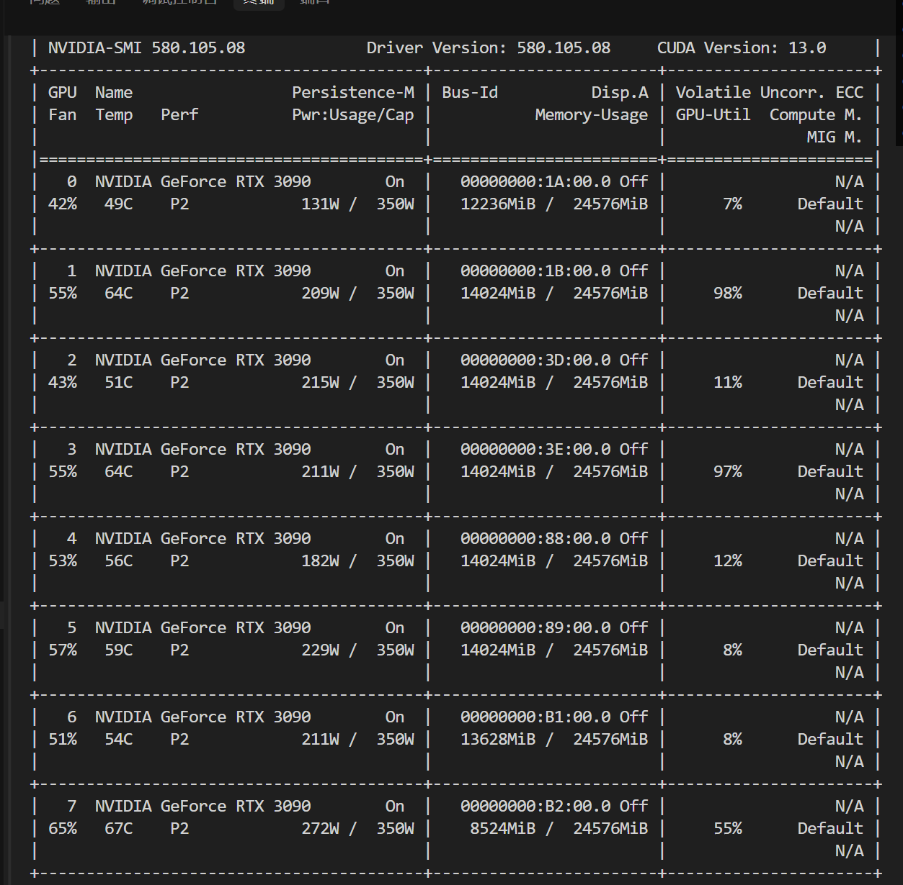
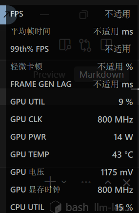

## 一些综合感受

和Llama重复的就不说了。

### 1. Qwen 比 Llama 更强一点

同样的问题下，Qwen 很少像之前 Llama 那样突然开始乱编作者、书名或者哲学家。

最明显的就是， 对于第一个prompt这种事实性问题的回答基本都正确。
说明 Qwen 在事实性问答上的稳定性明显更强。

但它很多回答只是换一种说法重新讲一遍。

---

### 2. Qwen 很容易进入“标准答案模式”，比较无聊

尤其 Prompt 2 和 Prompt 3。

一旦问题涉及“如何理解”这种开放式问题，

模型就很容易进入一种固定结构。整体很完整，但对于这种哲学问题，我觉得有点boring。

相比之下，Llama 更容易跑偏，但偶尔会出现更有意思的表达。

---

### 3. temperature 对 Qwen 的影响没有想象中大

Llama 在高 temperature 下明显会“放飞”。

但 Qwen 即使到：

```python
temperature = 1.2
```

整体仍然比较克制。

说明：

```text
Qwen 本身的回答风格就偏保守。
```
有机会了解了解它的机制。

---

### 4. top_p 与 max_new_tokens 

这次实验里，top_p 和 max_new_tokens 对回答风格都有明显作用：

- 核心观点基本稳定，但表达方式不同
- top_p 控制表达丰富度：
  - 低值（0.6）更简洁
  - 高值（0.95）更爱扩写
  - 极高值（0.98）偶尔啰嗦
- max_new_tokens 决定长度和展开程度：
  - 低值（128）回答短、直接，容易截断
  - 高值（512/768/1024）回答更完整，会补背景、展开解释和做总结

简单的说，有点像我写作文，对同一个题目，不管是100字，还是800字，表达的内核其实就那50字，剩下都是凑字数。(`没有说qwen在凑字数的意思`)

---

## 对 inference 的理解（现在）

1. chat template 先把 messages 拼成模型熟悉的格式
2. 模型不断预测“下一个 token”
3. sampling 参数决定：
   - 是保守选
   - 还是随机一点
4. 一直生成到：
   - EOS
   - 或 max_new_tokens 上限


## 附：一点训练时的小问题

### 为啥每个 GPU 不是平均使用？真正训练大型模型时，需要调整 GPU 分配以提高效率吗？

