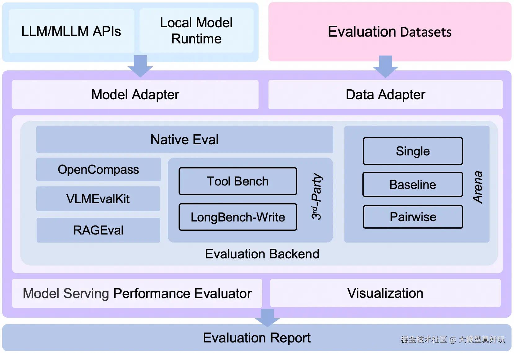

# EvalScope 流程简析




EvalScope 的整体流程其实可以简单理解成：

```text
模型输入
→ Adapter 做统一格式转换
→ Backend 跑 benchmark
→ 统计 accuracy、latency、throughput 等指标
→ 最后生成可视化评测报告
```

其中：

1. Model Adapter 负责统一不同模型的调用方式
2. Data Adapter 负责统一不同数据集格式
3. Evaluation Backend 真正执行 benchmark
4. Performance Evaluator 负责统计推理性能
5. 最后生成 visualization 和 evaluation report

## 评分机制


TruthfulQA 使用的是选择题模式，EvalScope 会要求模型输出类似：

```text
ANSWER: A
```

这样的格式，然后自动提取选项字母，并与标准答案进行比较。正确记 1，错误记 0，最后通过：

```text
正确题数 / 总题数
```

计算最终的 accuracy 分数。例如：

```text
3 / 5 = 0.6
5 / 5 = 1.0
```

## 比我想象的简单粗暴，难道是我恰巧选择了最简单的那一类？！（真的不是故意偷懒）

蒜鸟蒜鸟，考虑到还剩点时间，我再试试别的。

# Meta-Llama-3-8B-Instruct HumanEval 

## Performance Metrics

| Model | Dataset | Num | Avg Lat (s) | Avg Throughput (tok/s) | Avg Input Tokens | Avg Output Tokens |
|---|---|---|---|---|---|---|
| Meta-Llama-3-8B-Instruct | humaneval | 5 | 2.7477 | 23.8 | 144 | 65.4 |

---

## Evaluation Result

| Model | Dataset | Metric | Subset | Num | Score |
|---|---|---|---|---|---|
| Meta-Llama-3-8B-Instruct | humaneval | mean_acc | openai_humaneval | 5 | 1.0 |
| Meta-Llama-3-8B-Instruct | humaneval | mean_acc_pass@1 | openai_humaneval | 5 | 1.0 |

---
# HumanEval 评分机制

HumanEval 的评分机制是：模型根据题目生成 Python 代码，框架会自动执行这些代码并运行题目提供的测试用例。每个测试用例的输出与标准答案完全匹配才算通过，统计所有测试用例的平均通过率生成最终分数（如 mean_acc 或 pass@1）。也就是说，HumanEval 的分数完全依赖代码能否正确运行，而不是文本描述是否正确。


# GSM8K Benchmark - Meta-Llama-3-8B-Instruct

## Performance Metrics

| Model                     | Dataset | Num | Avg Lat (s) | Avg Throughput (tok/s) | Avg Input Tokens | Avg Output Tokens |
|---------------------------|---------|-----|-------------|------------------------|-----------------|-----------------|
| Meta-Llama-3-8B-Instruct | gsm8k   | 5   | 6.3231      | 24.55                  | 586.2           | 155.2           |

---

## Evaluation Result

| Model                     | Dataset | Metric   | Subset | Num | Score | Category |
|---------------------------|---------|---------|--------|-----|-------|---------|
| Meta-Llama-3-8B-Instruct | gsm8k   | mean_acc | main   | 5   | 0.8   | default |

---


# GSM8K 评分机制

GSM8K 是一个数学推理 benchmark，模型需要对文字题干生成最终数值答案。评分机制是：框架会解析模型输出的数值结果，并与题目提供的标准答案进行比较，只有答案完全匹配才算正确。最终通过统计所有样本的正确率来计算平均 accuracy 或 pass@1 分数。因此 GSM8K 的评分完全依赖模型的计算和多步推理能力，而不是文本描述或生成格式。

